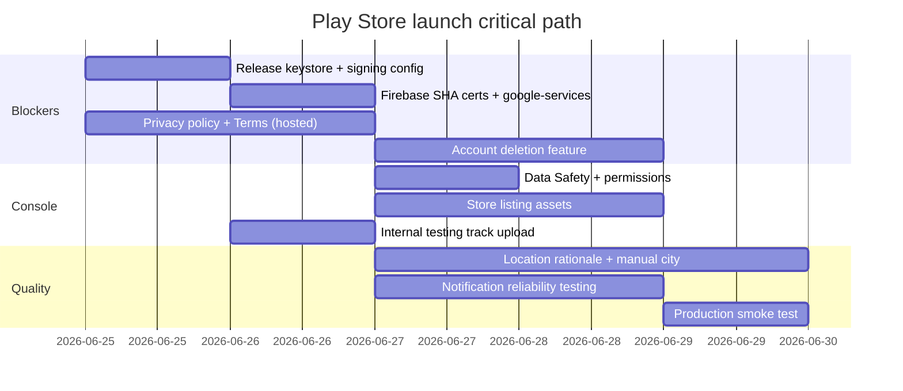

# Sazda — Google Play Store Readiness Audit

> **Generated:** June 25, 2026  
> **App:** Sazda (`com.sazda`) — Islamic lifestyle app (prayer times, Quran, Qibla, tools)  
> **Stack:** React Native 0.84.1 · Firebase Auth/Firestore · Notifee · Vision Camera  

This document lists **Play Store rejection risks**, **policy compliance gaps**, and **production bugs** found in the current codebase. Items are grouped by severity.

---

## Summary

| Severity | Count | Action |
|----------|-------|--------|
| 🔴 Blockers | 8 | Fix before submitting |
| 🟠 High (policy / broken in prod) | 12 | Fix before or immediately after first upload |
| 🟡 Medium (bugs / UX / review risk) | 14 | Fix for v1.0 quality |
| 🟢 Low (polish / recommended) | 10 | Schedule for post-launch |

**Bottom line:** The app is **not ready to submit** today. The most critical gaps are **release signing**, **Firebase/Google Sign-In SHA certificates**, **privacy policy + account deletion**, and **Play Console Data Safety / listing assets**.

---

## 🔴 Blockers — Will reject or break production

### 1. Release build uses debug signing key

`android/app/build.gradle` signs **release** builds with the debug keystore:

```gradle
release {
    signingConfig signingConfigs.debug  // ← must use production keystore
}
```

**Play Store impact:** You cannot ship a proper production app. Even if you upload once, you must register a real upload key and keep it safe for all future updates.

**Fix:**
- Generate a release keystore (`keytool -genkey ...`)
- Add `signingConfigs.release` and point `buildTypes.release` to it
- Store passwords in `local.properties` or CI secrets (never commit the keystore password)

---

### 2. Google Sign-In will fail on Play Store builds (SHA-1 mismatch)

`android/app/google-services.json` only registers the **debug** certificate:

```
certificate_hash: 5e8f16062ea3cd2c4a0d547876baa6f38cabf625
```

This matches `android/app/debug.keystore` exactly. Play-distributed APKs/AABs are signed with your **upload key** (and Google re-signs with the **app signing key**).

**Play Store impact:** Reviewers and users will see **Google Sign-In failed** on production builds. The app **requires** Google Sign-In in release (`guest mode` is `__DEV__` only in `authStore.ts`).

**Fix:**
1. Create release keystore and upload AAB to Play Console (internal testing track)
2. In Firebase Console → Project Settings → Your Android app → add SHA-1 fingerprints for:
   - Upload certificate
   - App signing certificate (from Play Console → Setup → App signing)
3. Download updated `google-services.json` and rebuild

---

### 3. No Privacy Policy URL (mandatory)

There is **no privacy policy** in the repo, in the app UI, or linked from the sign-in screen.

**Play Store impact:** **Automatic rejection.** Required for any app that collects personal or sensitive data (location, email, Firebase Auth, Crashlytics).

**Fix:**
- Publish a privacy policy at a public HTTPS URL (your website or Notion/GitHub Pages)
- Add link on Sign-In screen, Settings, and Play Console listing
- Cover: location, Google account data, Firestore sync, Crashlytics, third-party APIs (Aladhan, AlQuran.cloud)

---

### 4. No account & data deletion flow (mandatory)

Production users **must sign in with Google** (`selectAppUnlocked` only allows guests in `__DEV__`). Google Play's [User Data policy](https://support.google.com/googleplay/android-developer/answer/13327111) requires:

- In-app path to **request account deletion**
- Deletion of associated server-side data (Firestore: `users/{uid}/**`)

Current `signOut()` only clears local session — it does **not** delete Firebase Auth user or Firestore documents.

**Play Store impact:** **Policy rejection** during review for apps with account creation.

**Fix:**
- Add **Delete my account** in Profile → Settings
- Call Firebase `deleteUser()`, delete `users/{uid}` tree, revoke Google token
- Document deletion timeline in privacy policy (e.g. within 30 days)

---

### 5. `.env` is committed to Git with real secrets

`.env` is tracked in git (`git ls-files .env` returns the file). It is **not** in `.gitignore`.

Contains Firebase API keys, project IDs, and Google OAuth client IDs.

**Play Store impact:** Security incident risk; leaked keys can be abused before review. Play may flag apps with exposed credentials in decompiled bundles if the same keys are embedded.

**Fix:**
- Add `.env` to `.gitignore` immediately
- Rotate any exposed Firebase/API keys
- Use `.env.example` for documentation only (already exists)

---

### 6. Play Console listing not prepared

No store assets or copy exist in the repo:

- Feature graphic (1024×500)
- Phone screenshots (min 2, recommended 8)
- Short description (80 chars) + full description (4000 chars)
- App category (Lifestyle or Books & Reference)
- Contact email (required, publicly visible)

**Play Store impact:** Cannot complete the listing; submission blocked.

---

### 7. Data Safety form not completed

The app collects sensitive data that **must** be declared in Play Console → Data safety:

| Data type | Source | Purpose |
|-----------|--------|---------|
| Precise location | GPS (`ACCESS_FINE_LOCATION`) | Prayer times, Qibla |
| Email, name, photo | Google Sign-In / Firebase Auth | Account & sync |
| App activity | Firestore (Quran bookmarks, Zakat, prayer tracker) | Cloud sync |
| Crash logs | Firebase Crashlytics (native plugin applied) | Diagnostics |
| Device IDs | Firebase, device info | Auth / analytics |

**Play Store impact:** **Rejection** if form is empty or contradicts actual behavior.

**Fix:** Complete the form honestly. Mark data as encrypted in transit (HTTPS). Specify whether collection is optional or required.

---

### 8. App access credentials for reviewers

Because login is **required** in production, Play Console's **App access** section needs:

- Test Google account credentials, **or**
- Instructions + demo account that reviewers can use

**Play Store impact:** Review delay or rejection if reviewers cannot log in.

---

## 🟠 High — Policy risk or production failures

### 9. No Terms of Service

Not required in all cases, but recommended for apps with accounts, cloud sync, and religious content. Pair with privacy policy on sign-in screen.

---

### 10. Sign-in screen missing legal links

`SignInScreen.tsx` shows Google Sign-In but no links to Privacy Policy or Terms. Add tappable links below the sign-in button.

---

### 11. Location permission without manual fallback

Prayer times depend on GPS (`prayerLocationGps.ts`). There is **no manual city search** — only reverse geocoding after GPS.

If the user denies location:
- Prayer times show errors / dashes
- Qibla and widgets may not work

**Play Store impact:** Reviewers may report "app doesn't work" if they deny location on first launch. Google expects a **clear in-app disclosure** before the system permission dialog explaining why location is needed.

**Fix:**
- Show a pre-permission rationale screen (onboarding or first home visit)
- Add manual city/coordinate picker as fallback

---

### 12. Camera permission (Qibla AR)

`AndroidManifest.xml` declares `CAMERA`. Used in `QiblaARScreen.tsx` via `react-native-vision-camera`.

**Play Store impact:** Must declare camera use in Data Safety and permission declaration. Feature must work on review devices or be hidden if broken.

**Status:** Deep analysis notes Qibla AR needs Android testing. Broken AR on review devices = bad review score (not always rejection).

---

### 13. Adhan notifications may be unreliable on Android 12+

Prayer reminders use Notifee trigger notifications (`prayerReminders.ts`). Widgets use `AlarmManager.setExact()` with `SecurityException` fallback to inexact alarms (`PrayerWidgetModule.kt`).

**Risks:**
- No `SCHEDULE_EXACT_ALARM` / `USE_EXACT_ALARM` in manifest (may be merged from libraries — verify merged manifest)
- No battery optimization exemption prompt
- `bypassDnd: true` for LOUD adhan mode without `ACCESS_NOTIFICATION_POLICY` permission

**Play Store impact:** Not a direct rejection, but reviewers testing notifications may report core feature as broken → rejection for "not working as described."

**Fix:**
- Test adhan firing on Android 13/14/15 with battery saver on
- Guide users to disable battery optimization for Sazda
- Handle exact-alarm permission on Android 12+

---

### 14. Firestore security rules must be deployed

Rules exist at `firebase/firestore.rules` (user-scoped access) but must be **deployed** to Firebase:

```bash
firebase deploy --only firestore:rules
```

**Play Store impact:** If rules are open or missing, user data breach → app removal.

---

### 15. Version number inconsistency

| Source | Version |
|--------|---------|
| `package.json` | `0.0.1` |
| `android/app/build.gradle` | `versionName "1.0"`, `versionCode 1` |

**Fix:** Align all sources. Increment `versionCode` for every Play upload.

---

### 16. `api.sazda.app` placeholder backend

`src/services/api.ts` points to `https://api.sazda.app` but is **not used** anywhere in the app (only exported from `services/index.ts`).

Low immediate risk, but remove or implement before adding features that call it.

---

### 17. Crashlytics plugin enabled but not wired in JS

`build.gradle` applies `com.google.firebase.crashlytics` and the dependency is in `package.json`, but:
- No `@react-native-firebase/crashlytics` import in app code
- `ErrorBoundary` has a comment about Crashlytics but only `console.error`

**Impact:** Missed crash reporting in production. Declare Crashlytics in Data Safety only if it actually collects data.

---

### 18. Google Play target API level

`targetSdkVersion = 36` ✅ — meets 2026 requirements.

Verify **16 KB page size** compatibility for Android 15+ devices (Google requirement for apps targeting API 35+). Test release AAB on a 16 KB emulator or Play pre-launch report.

---

### 19. Religious / Quran content attribution

Quran text and tafsir come from **api.alquran.cloud** (`quranApi.ts`, `TafsirScreen.tsx`). Offline editions use `quran-uthmani+en.sahih` and `ar.alafasy` audio metadata.

**Play Store impact:** Unlikely rejection, but you should:
- Credit data sources in app (About screen)
- Confirm API terms of use allow commercial app distribution
- Avoid claiming official religious authority in store listing copy

---

### 20. Content rating questionnaire

Complete IARC questionnaire in Play Console. Islamic prayer app with user accounts → typically **Everyone** or **3+**, but answer honestly about user-generated content (currently none), location sharing, and sign-in.

---

## 🟡 Medium — Bugs and review-quality issues

### 21. Prayer tracker data grows unbounded

`prayerTrackerStore.byDay` persists every day forever in MMKV. Long-term users may hit storage/performance issues.

**Fix:** Prune entries older than 365 days on launch.

---

### 22. Prayer tracker / Tasbeeh cloud sync incomplete

Firestore sync exists for Zakat and Quran bookmarks, but prayer tracker and Tasbeeh are primarily local. Users reinstalling lose data — bad reviews, not Play rejection.

---

### 23. Zakat currency hardcoded to INR

`zakatStore.ts` uses `currency: 'INR'`. Global Play audience may find this confusing.

---

### 24. Offline Quran auto-download on first Quran tab visit

`scheduleOfflineQuranBootstrapIfNeeded()` downloads 4 priority surahs (1, 36, 67, 112) without explicit user consent dialog.

**Risk:** Unexpected mobile data usage → bad reviews. Not a policy violation if disclosed in privacy policy.

---

### 25. No error reporting in production

`ErrorBoundary` exists at app root ✅ but only shows "Try Again" — no crash log upload.

---

### 26. Limited test coverage

Only 2 Jest tests (`App.test.tsx`, `prayerTimesCache.test.ts`). No E2E tests for sign-in, notifications, or Quran reader.

---

### 27. ESLint scans vendor/ruby bundles

`npm run lint` reports 371 problems, mostly from `vendor/bundle/`. Configure `.eslintignore` to lint `src/` only.

---

### 28. Android build log shows failure (environmental)

`android/build_output.log` ends with `BUILD FAILED` — Gradle cache corruption (`immutable workspace modified`). Clean fix:

```bash
cd android && ./gradlew clean
# or delete ~/.gradle/caches/9.0.0/transforms/...
./gradlew bundleRelease
```

Verify a clean **release AAB** builds before upload.

---

### 29. ProGuard / R8 minification disabled

`enableProguardInReleaseBuilds = false` — larger APK/AAB. Not a rejection issue; `proguard-rules.pro` is empty if you enable it later.

---

### 30. Widget receivers exported

`TodayPrayerWidgetProvider` and `DailyFlowWidgetProvider` have `android:exported="true"`. Standard for widgets; ensure no sensitive data in widget intents.

---

### 31. `HIGH_SAMPLING_RATE_SENSORS` permission

Declared for compass/Qibla (Reanimated sensors). Declare in Play Console if prompted for sensor permissions.

---

### 32. WebView in Quran audio player

`QuranAudioBar.tsx` uses `react-native-webview` for audio playback. Ensure WebView only loads trusted URLs (no arbitrary user content).

---

### 33. Mood selector on HomeScreen is non-functional

UI-only mood buttons with no persistence — polish issue, may look unfinished to reviewers.

---

### 34. `juzHint()` approximation in Quran Home

Hardcoded math may show wrong Juz numbers — accuracy complaint risk for a Quran app.

---

## 🟢 Low — Polish and post-launch

| # | Item | Notes |
|---|------|-------|
| 35 | README is default React Native template | Replace with Sazda-specific setup (env, Firebase, signing) |
| 36 | No in-app "Rate us" / feedback flow | Impacts growth, not review |
| 37 | Accessibility audit incomplete | Some `accessibilityLabel` usage exists; not comprehensive |
| 38 | No tablet-optimized layouts | Play supports tablets; layout may stretch |
| 39 | No deep links (`sazda://`) | Optional for v1 |
| 40 | Test adhan helpers still in code | `sendTestAdhanNotification` in `prayerReminders.ts` — ensure not exposed in UI |
| 41 | Community feature folders empty | Dead code paths — remove or hide |
| 42 | Daily wisdom quote hardcoded | Same ayah every day in Tools home |
| 43 | `react-native-document-picker` deprecated | Package marked deprecated; plan migration |
| 44 | No CI/CD pipeline | Manual builds only — human error risk |

---

## Play Console submission checklist

Use this as a pre-flight list before clicking **Submit for review**.

### Build & signing
- [ ] Production keystore created and backed up securely
- [ ] Release AAB built (`./gradlew bundleRelease`)
- [ ] `versionCode` incremented
- [ ] Firebase SHA-1/SHA-256 added for upload + app signing certificates
- [ ] Updated `google-services.json` in project
- [ ] Clean build verified (no Gradle cache errors)
- [ ] Tested on Android 13, 14, 15 physical devices or emulators

### Legal & policy
- [ ] Privacy policy published (HTTPS URL)
- [ ] Terms of service published (recommended)
- [ ] Privacy policy link in app (Sign-In + Settings)
- [ ] Account deletion flow implemented and tested
- [ ] Data Safety form completed accurately
- [ ] Permission declarations (location, camera, notifications) completed
- [ ] Content rating (IARC) completed

### Store listing
- [ ] App name: **Sazda**
- [ ] Short + full description written
- [ ] App icon 512×512 (use `src/assets/images/sazda-app-icon.png` as base)
- [ ] Feature graphic 1024×500
- [ ] At least 2 phone screenshots (Home, Quran, Prayer, Qibla)
- [ ] Developer contact email
- [ ] App access instructions for reviewers (test Google account)

### Functional smoke test (reviewer path)
- [ ] Fresh install → onboarding → Google Sign-In works
- [ ] Location permission flow → prayer times load
- [ ] Enable notifications → test adhan fires (or schedule test)
- [ ] Quran reader opens surah
- [ ] Qibla compass works
- [ ] Sign out works
- [ ] Delete account works (once implemented)
- [ ] Widgets update (if claiming widget feature in listing)

---

## Suggested fix order (1–2 weeks)



---

## Files reviewed

| Area | Key files |
|------|-----------|
| Android config | `android/app/build.gradle`, `AndroidManifest.xml`, `google-services.json` |
| Auth | `src/store/authStore.ts`, `src/screens/auth/SignInScreen.tsx` |
| Permissions | `src/services/locationPermission.ts`, `prayerReminders.ts` |
| Firebase | `src/config/firebasePublic.ts`, `firebase/firestore.rules` |
| Notifications | `src/services/prayerReminders.ts`, `PrayerWidgetModule.kt` |
| Privacy | *(none found)* |

---

## References

- [Play Console Help — Publish an app](https://support.google.com/googleplay/android-developer/answer/9859751)
- [User Data policy (account deletion)](https://support.google.com/googleplay/android-developer/answer/13327111)
- [Data safety section](https://support.google.com/googleplay/android-developer/answer/10787469)
- [Target API level requirements](https://developer.android.com/google/play/requirements/target-sdk)
- [Firebase — Add SHA fingerprint](https://firebase.google.com/docs/android/setup#add-sha)

---

*This audit is based on static code review of the repository as of June 25, 2026. Run Play Console Pre-launch reports and internal testing before production release.*
