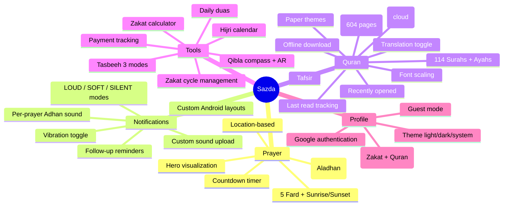
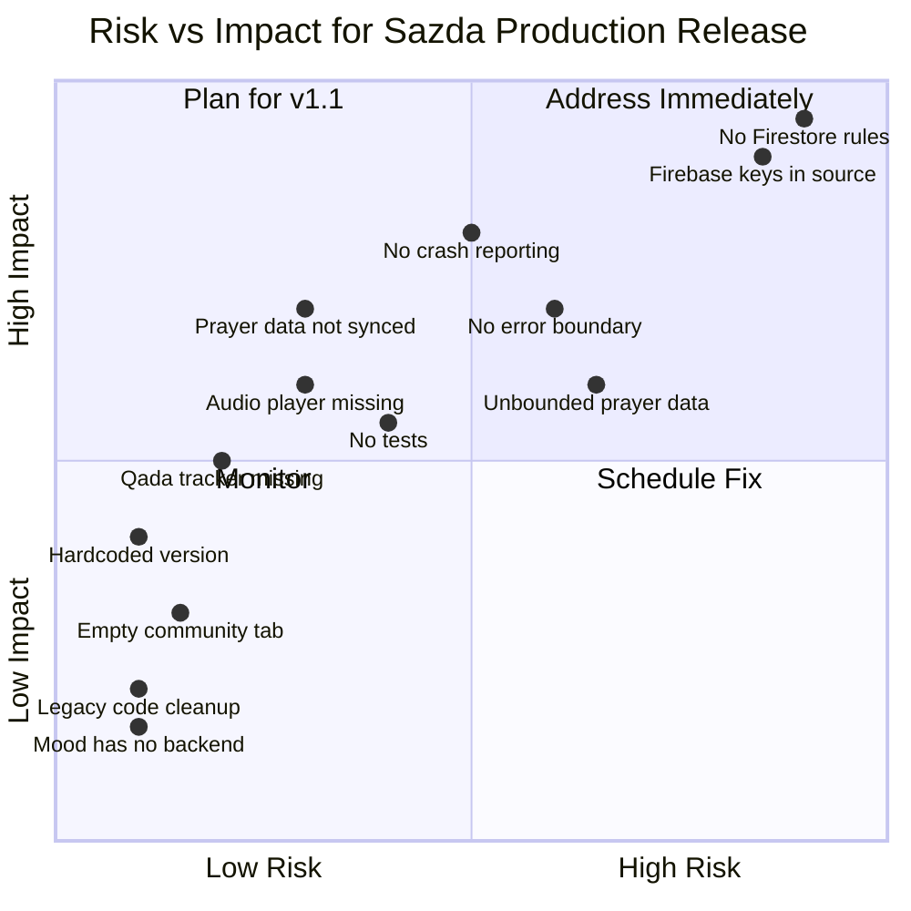

# Sazda — Deep Application Analysis

> **Generated:** April 10, 2026  
> **Codebase Snapshot:** React Native 0.84.1 · React 19.2.3 · Zustand 5 · Firebase 11.10 · Notifee 9.1.8  
> **Developer:** farukhchenda

---

## Table of Contents

1. [Feature Inventory](#1-feature-inventory)
2. [Architecture & Tech Stack Review](#2-architecture--tech-stack-review)
3. [Current Issues & Technical Debt](#3-current-issues--technical-debt)
4. [UI/UX Improvement Areas](#4-uiux-improvement-areas)
5. [Security & Privacy Concerns](#5-security--privacy-concerns)
6. [Performance Observations](#6-performance-observations)
7. [New Feature Suggestions](#7-new-feature-suggestions)
8. [Production Readiness Checklist](#8-production-readiness-checklist)
9. [Risk Matrix](#9-risk-matrix)

---

## 1. Feature Inventory

### 1.1 Core Features

| # | Feature | Screens | Store | Cloud Sync | Status |
|---|---------|---------|-------|-----------|--------|
| 1 | **Prayer Times** | `HomeScreen`, `HomePrayerHeroAnimated`, `HomePrayerTimesList` | `prayerLocationStore` | ❌ | ✅ Stable |
| 2 | **Adhan Notifications** | `AdhanSettingsScreen`, `SoundSelectionScreen`, `CustomSoundUploadScreen` | `adhanSettingsStore` | ❌ | ✅ Stable |
| 3 | **Prayer Tracker** | `PrayerTrackerScreen` | `prayerTrackerStore` | ❌ | ✅ Stable |
| 4 | **Prayer Streak** | Hook `usePrayerStreak` | derives from `prayerTrackerStore` | ❌ | ✅ Stable |
| 5 | **Qibla Compass** | `QiblaScreen` | — | — | ✅ Stable |
| 6 | **Qibla AR View** | `QiblaARScreen` | — | — | ⚠️ Android needs testing |
| 7 | **Quran Reader** | `SurahListScreen`, `SurahReaderScreen` | `quranProgressStore` | ✅ Firestore | ✅ Stable |
| 8 | **Mushaf Reader** | `MushafReaderScreen`, `MushafPageSlide` | `mushafReaderStore` | Partial | ✅ Stable |
| 9 | **Quran Bookmarks** | Part of `SurahListScreen` | `quranProgressStore` | ✅ Subcollection | ✅ Stable |
| 10 | **Tafsir** | `TafsirScreen` | — | — | ✅ Stable |
| 11 | **Offline Quran** | `OfflineQuranManagerScreen` | `offlineQuranDownloadStore` | ❌ Local-only | ✅ Stable |
| 12 | **Daily Duas** | `DailyDuasScreen` | Static data | — | ✅ Stable |
| 13 | **Tasbeeh Counter** | `TasbeehScreen`, `TasbeehCounter` organism | `tasbeehStore` | ❌ | ✅ Stable |
| 14 | **Zakat Manager** | `ZakatDashboardScreen`, `ZakatCalculatorScreen`, `ZakatCycleManageScreen`, `ZakatAddPaymentScreen`, `ZakatPaymentHistoryScreen`, `ZakatInsightsScreen` | `zakatStore` | ✅ Firestore | ✅ Stable |
| 15 | **Hijri Calendar** | `HijriCalendarScreen` | — (API-driven) | — | ✅ Stable |
| 16 | **Google Sign-In** | `SignInScreen`, `SignInSuccessScreen` | `authStore` | — | ✅ Stable |
| 17 | **Guest Mode** | `SignInScreen` | `authStore` | — | ✅ Stable |
| 18 | **Theme System** | `ProfileSettingsScreen` | `themeStore` | ❌ | ✅ Stable |
| 19 | **Android Widgets** | Native `TodayPrayerWidgetProvider`, `DailyFlowWidgetProvider` | Native bridge | — | ⚠️ Recently fixed |
| 20 | **Custom Notifications** | `SazdaCustomNotificationModule.kt` | — | — | ⚠️ Recently fixed |
| 21 | **Custom AppAlert** | `AppAlertManager.tsx`, `AppAlert.ts` | Imperative subscriber | — | ✅ Just implemented |
| 22 | **Onboarding** | `OnboardingScreen` | — | — | ✅ Stable |
| 23 | **Notification Onboarding** | `NotificationOnboardingModal` | `notificationOnboardingStore` | — | ✅ Stable |

### 1.2 Feature Depth



---

## 2. Architecture & Tech Stack Review

### 2.1 Stack Summary

| Layer | Technology | Version | Notes |
|-------|-----------|---------|-------|
| Runtime | React Native | 0.84.1 | Latest stable ✅ |
| UI Framework | React | 19.2.3 | Latest ✅ |
| State | Zustand + MMKV persistence | 5.0.12 | Excellent choice ✅ |
| Navigation | React Navigation 7 | 7.x | Bottom tabs + Drawer + Stack ✅ |
| Animation | Reanimated 4 | 4.2.2 | ✅ |
| Networking | Axios + React Query | 1.13 / 5.91 | ✅ |
| Auth | Firebase Auth + Google Sign-In | 11.10 | ✅ |
| Database | Firestore | 11.10 | Zakat + Quran sync ✅ |
| Notifications | Notifee | 9.1.8 | ✅ |
| Storage | MMKV | 4.2.0 | Fast key-value ✅ |
| Camera | Vision Camera | 4.7.3 | For AR Qibla ✅ |
| Icons | Lucide React Native | 0.577 | Tree-shakeable ✅ |

### 2.2 Architecture Pattern

```
┌─────────────────────────────────────────────┐
│                   Screens                    │
│  (Home, Quran, Tools, Qibla, Profile tabs)  │
├─────────────────────────────────────────────┤
│           Components (Atomic Design)         │
│        Atoms → Molecules → Organisms         │
├──────────────────┬──────────────────────────┤
│    Zustand Stores │    Services / API        │
│  (17 stores with  │  (Aladhan, QuranAPI,    │
│   MMKV persist)   │   Firebase, Geoloc)     │
├──────────────────┴──────────────────────────┤
│           React Query Cache Layer            │
├─────────────────────────────────────────────┤
│      Native Modules (Android/iOS)            │
│  (Widgets, Custom Notifications, Camera)     │
└─────────────────────────────────────────────┘
```

### 2.3 Strengths

- **Excellent state management**: Zustand with MMKV persistence is fast and reliable
- **Cloud sync architecture**: Zakat and Quran use timestamp-based conflict resolution (newer wins)
- **Offline-first**: Quran data can be fully downloaded for offline use
- **Design system**: Custom theme config with light/dark modes, Islamic color palettes
- **Notification system**: Multi-layer notifications — per-prayer Adhan sounds, follow-up reminders, custom Android layouts

---

## 3. Current Issues & Technical Debt

### 3.1 Critical Issues

> [!CAUTION]
> These can cause crashes or data loss in production.

| # | Issue | Impact | Location |
|---|-------|--------|----------|
| 1 | **Firebase API key is hardcoded in source** | Security: Anyone decompiling the APK gets full API access | [firebasePublic.ts](file:///Users/farukhchenda/Desktop/farukh-modules/Apps/Sazda/src/config/firebasePublic.ts#L14-L22) |
| 2 | **Google OAuth Client IDs are in source code** | Security: Attackers could impersonate the app | [firebasePublic.ts](file:///Users/farukhchenda/Desktop/farukh-modules/Apps/Sazda/src/config/firebasePublic.ts#L28-L33) |
| 3 | **No prayerTrackerStore cloud sync** | Prayer history is local-only — user loses all data on reinstall | [prayerTrackerStore.ts](file:///Users/farukhchenda/Desktop/farukh-modules/Apps/Sazda/src/store/prayerTrackerStore.ts) |
| 4 | **No Tasbeeh cloud sync** | Tasbeeh cycles count is local-only | [tasbeehStore.ts](file:///Users/farukhchenda/Desktop/farukh-modules/Apps/Sazda/src/store/tasbeehStore.ts) |
| 5 | **`prayerTrackerStore.byDay` grows unbounded** | After 1+ year of daily use, the MMKV key could hit hundreds of KB with every day's entry persisted forever | [prayerTrackerStore.ts](file:///Users/farukhchenda/Desktop/farukh-modules/Apps/Sazda/src/store/prayerTrackerStore.ts#L16) |
| 6 | **APP_VERSION is hardcoded `'0.0.1'`** | Not synced with `package.json` or native builds — always shows wrong version | [ProfileSettingsScreen.tsx](file:///Users/farukhchenda/Desktop/farukh-modules/Apps/Sazda/src/screens/profile/ProfileSettingsScreen.tsx#L24) |

### 3.2 Moderate Issues

> [!WARNING]
> These cause degraded UX or maintenance burden.

| # | Issue | Impact | Location |
|---|-------|--------|----------|
| 7 | **Community feature directory is empty** | `src/screens/community/` and `src/features/community/` exist but contain nothing — dead code paths | `src/screens/community/` |
| 8 | **Deprecated `InteractionManager` usage** | Console warnings on every app session; will break in future RN releases | [deviceGeolocation.ts](file:///Users/farukhchenda/Desktop/farukh-modules/Apps/Sazda/src/services/deviceGeolocation.ts#L32) |
| 9 | **MMKV storage factory duplicated 10+ times** | Every store file creates the same `mmkvStorage` wrapper — should be a shared utility | All store files |
| 10 | **Daily wisdom quote is hardcoded** | The "Daily wisdom" section in ToolsHome shows the same quote every day (Ar-Ra'd 13:28) | [ToolsHomeScreen.tsx](file:///Users/farukhchenda/Desktop/farukh-modules/Apps/Sazda/src/screens/tools/ToolsHomeScreen.tsx#L251) |
| 11 | **`juzHint()` is a rough approximation** | The Quran Home's juz label uses hardcoded math instead of actual Surah→Juz mapping — will show wrong juz numbers | [QuranHomeScreen.tsx](file:///Users/farukhchenda/Desktop/farukh-modules/Apps/Sazda/src/screens/quran/QuranHomeScreen.tsx#L334-L339) |
| 12 | **No error boundary** | A single JS crash anywhere will show a white/red screen — no graceful fallback | App root |
| 13 | **Legacy exports still present** | `LEAD_OPTIONS` / `LeadMinutes` in `prayerReminderStore.ts` are marked `@deprecated` but still exported | [prayerReminderStore.ts](file:///Users/farukhchenda/Desktop/farukh-modules/Apps/Sazda/src/store/prayerReminderStore.ts#L94-L96) |
| 14 | **Zakat currency locked to INR** | `currency: 'INR'` is hardcoded with a comment saying "future multi-currency" but no UI to change it | [zakatStore.ts](file:///Users/farukhchenda/Desktop/farukh-modules/Apps/Sazda/src/store/zakatStore.ts#L17) |
| 15 | **Font family strings inconsistent** | Some components use `'Manrope'` and `'Plus Jakarta Sans'` as raw strings, others use `fontFamilies.headline` | Splash screen vs theme system |
| 16 | **No Android ProGuard rules audit** | Release builds may strip necessary native classes without proper keep rules | `android/app/proguard-rules.pro` |

### 3.3 Low Priority / Cleanup

| # | Issue | Location |
|---|-------|----------|
| 17 | Unused `ToolsScreen.tsx` file (68 bytes, just an export) | `src/screens/tools/ToolsScreen.tsx` |
| 18 | `.gitkeep` files left in atoms and organisms | `src/components/atoms/.gitkeep` |
| 19 | `Mood` feature on HomeScreen (`MoodId` type) appears UI-only with no persistence or purpose | [HomeScreen.tsx](file:///Users/farukhchenda/Desktop/farukh-modules/Apps/Sazda/src/screens/home/HomeScreen.tsx#L56) |
| 20 | No unit tests exist (jest configured but 0 test files found) | `package.json` has `jest` but no `__tests__` directory |
| 21 | `sendTestAdhanNotification` and `scheduleTestAdhanInSeconds` still exported from `prayerReminders.ts` even after removing from UI | [prayerReminders.ts](file:///Users/farukhchenda/Desktop/farukh-modules/Apps/Sazda/src/services/prayerReminders.ts#L343-L416) |

---

## 4. UI/UX Improvement Areas

### 4.1 Home Screen
- **Current status indicator is missing**: User can't tell at a glance whether the current time is Makruh, prayer time active, or between prayers
- **Mood selector has no backend**: The mood buttons on HomeScreen don't persist or affect anything
- **Location bar could auto-detect**: Users often have to manually tap to set location

### 4.2 Quran Reader
- **No audio playback controls**: Audio URLs are stored offline but no play/pause/seek UI exists in the Surah reader
- **Progress tracking is per-surah only**: No ayah-level progress bar showing how much of surah you've read
- **No night-time auto-theme**: Reader doesn't switch to dark/sepia automatically at night

### 4.3 Prayer Tracker
- **No weekly/monthly view**: Only daily toggles — no calendar heat-map for motivation
- **No missed prayer Qada tracker**: Common Islamic practice to make up missed prayers
- **No streak notifications**: App knows the streak count but doesn't celebrate milestones

### 4.4 Tasbeeh
- **No session history**: Completed cycles vanish — no log of how many rounds were done today/this week
- **No target-based daily goals**: e.g. "Do 500 dhikr today"

### 4.5 General
- **No haptic confirmation on important actions** (beyond Tasbeeh which already has it)
- **Empty community tab placeholder** — should either be built or removed
- **No "Rate this app" or "Share with friends" flow**
- **No accessibility audit**: Missing `accessibilityLabel` on many interactive elements

---

## 5. Security & Privacy Concerns

> [!CAUTION]
> These must be addressed before any public Play Store / App Store release.

| # | Concern | Risk Level | Detail |
|---|---------|-----------|--------|
| 1 | **Firebase config in source** | 🔴 High | API keys, project IDs, and OAuth client IDs are committed to source. While Firebase Security Rules can mitigate API key exposure, the OAuth client IDs should use environment variables or native config files (e.g., `google-services.json` / `GoogleService-Info.plist`) exclusively. |
| 2 | **No Firestore security rules referenced** | 🔴 High | No `firestore.rules` file in the project. If rules default to open, any authenticated user can read/write any other user's Zakat and Quran data. |
| 3 | **No rate limiting on cloud sync** | 🟡 Medium | `scheduleZakatCloudSync` debounces at 2s, but rapid user interactions could still create excessive Firestore writes, increasing billing. |
| 4 | **GPS coordinates not encrypted at rest** | 🟡 Medium | `prayerLocationStore` persists raw lat/lng in MMKV (unencrypted by default). |
| 5 | **No privacy policy / terms of service** | 🟡 Medium | Required for both stores. |
| 6 | **Custom sound upload has no file-size validation** | 🟡 Medium | User could upload a 500MB audio file as custom Adhan — no guard in `CustomSoundUploadScreen`. |

---

## 6. Performance Observations

### 6.1 Positive Patterns ✅
- MMKV over AsyncStorage for persistence — orders of magnitude faster
- React Query with appropriate `staleTime` (1hr for prayer, 24hr for Quran catalog)
- `FlatList` with `removeClippedSubviews` and `windowSize` in DailyDuas
- Memoized style factories (`createHomeStyles`, `createToolsStyles`) with scheme dependency

### 6.2 Concerns ⚠️

| Area | Issue | Suggestion |
|------|-------|-----------|
| **Home Screen** | `HomeScreen.tsx` is 739 lines — monolithic with inline style factories | Extract into sub-components with their own styles |
| **Quran Home** | `QuranHomeScreen.tsx` is 553 lines with deeply nested style logic | Same — decompose |
| **Reanimated on Android** | `FadeInDown.duration(400).delay(XXX)` used heavily in AdhanSettings — cascaded delays across ~10 elements | Consider fewer `Animated.View` wrappers or simple opacity fades |
| **Prayer countdown** | `usePrayerTimesHome` likely re-renders every second for countdown — verify it's not triggering full tree re-renders | Use `useAnimatedStyle` for countdown display |
| **Offline Quran** | Full 114-surah auto-download starts on first Quran tab visit — could consume significant data without user consent | Show explicit opt-in before bulk download |

---

## 7. New Feature Suggestions

### 7.1 High Value / Low Effort

| # | Feature | Description | Effort |
|---|---------|-------------|--------|
| 1 | **Dynamic daily wisdom** | Rotate quotes from a curated JSON list (100+ ayahs/hadiths) instead of hardcoded single quote | 2 hrs |
| 2 | **App version from native** | Use `react-native-device-info` or a build-time constant to show the real version, not `'0.0.1'` | 1 hr |
| 3 | **Prayer tracker cloud sync** | Mirror the Zakat sync pattern for `prayerTrackerStore.byDay` → Firestore | 4 hrs |
| 4 | **Streak milestone celebrations** | Show confetti / AppAlert on 7-day, 30-day, 100-day streaks | 3 hrs |
| 5 | **Error boundary** | Wrap app root with a graceful fallback screen + "Restart" button | 2 hrs |
| 6 | **Prayer tracker data cleanup** | Prune entries older than 365 days from `byDay` on app launch | 1 hr |
| 7 | **Shared MMKV storage utility** | Extract the duplicated MMKV storage factory to `src/services/storage.ts` | 1 hr |

### 7.2 High Value / Medium Effort

| # | Feature | Description | Effort |
|---|---------|-------------|--------|
| 8 | **Quran audio player** | Play recitation audio inline in SurahReader — play/pause/progress bar | 2 days |
| 9 | **Prayer calendar heat-map** | Monthly calendar grid colored by prayer completion rate (like GitHub contributions) | 1 day |
| 10 | **Qada (missed prayer) tracker** | Separate section to log and track make-up prayers | 1 day |
| 11 | **Tasbeeh session history** | Log daily sessions with timestamps and total counts | 4 hrs |
| 12 | **Ramadan mode** | Special UI theme, suhoor/iftar timers, Ramadan-specific duas, fasting tracker | 2 days |
| 13 | **Widget data refresh** | Ensure prayer times and next-prayer info update on widgets periodically via WorkManager / BackgroundFetch | 1 day |
| 14 | **Multi-language support** | Start with Urdu, Hindi, Arabic UI translations using `i18n` | 2 days |
| 15 | **Deep link support** | `sazda://quran/2/255` to open specific ayah — helpful for sharing | 4 hrs |

### 7.3 High Value / High Effort

| # | Feature | Description | Effort |
|---|---------|-------------|--------|
| 16 | **Community / Social feed** | Share daily progress, duas, Quran achievements with friends | 1–2 weeks |
| 17 | **Islamic AI assistant** | Context-aware Q&A about Islamic topics (Hadith lookup, fiqh questions) | 1 week |
| 18 | **Mosque finder** | Nearby mosques with maps, prayer times, and directions | 1 week |
| 19 | **Quran memorization (Hifz) tracker** | Track memorized juz/surahs/ayahs with spaced repetition review | 1 week |
| 20 | **Hadith of the day** | Curated Hadith collection with daily push notification | 3 days |
| 21 | **Sadaqah / charity tracker** | Extend Zakat manager to track general charity donations | 3 days |
| 22 | **Islamic event countdown** | Countdown widgets for Ramadan, Eid, Hajj based on Hijri calendar data | 2 days |
| 23 | **Quran word-by-word** | Show Arabic word meanings on tap (from corpus data) | 1 week |

### 7.4 Technical Improvements

| # | Feature | Description |
|---|---------|-------------|
| 24 | **Crashlytics integration** | Firebase Crashlytics for production crash reporting |
| 25 | **Analytics events** | Track feature usage (which tools are most popular, quran reading patterns) |
| 26 | **E2E testing** | Detox or Maestro for critical user flows (sign-in, prayer tracking, Quran reading) |
| 27 | **CI/CD pipeline** | GitHub Actions for automated builds (APK/IPA) and lint checks |
| 28 | **App Store optimization** | Screenshots, descriptions, keyword optimization for both stores |
| 29 | **OTA updates** | CodePush or EAS Update for instant JS bundle deployments |
| 30 | **Tablet layout** | Responsive layouts for iPad / Android tablets |

---

## 8. Production Readiness Checklist

| Category | Item | Status |
|----------|------|--------|
| **Security** | Firebase API keys protected via Security Rules | ❓ Unverified |
| **Security** | Firestore rules restrict per-user access | ❓ Missing from repo |
| **Security** | Custom sound upload file-size limit | ❌ Missing |
| **Security** | Privacy policy and terms of service | ❌ Missing |
| **Stability** | Error boundary on app root | ❌ Missing |
| **Stability** | Zero unit/integration tests | ❌ Missing |
| **Stability** | Crashlytics or equivalent | ❌ Missing |
| **Performance** | Prayer tracker data pruning | ❌ Missing |
| **Performance** | Bundle size analysis (Hermes) | ❓ Not audited |
| **UX** | App version displayed correctly | ❌ Hardcoded `0.0.1` |
| **UX** | Rate/review prompt | ❌ Missing |
| **UX** | Accessibility audit | ❌ Not done |
| **Distribution** | Android release signing configured | ✅ Builds successfully |
| **Distribution** | iOS archive and signing | ❓ Not tested in this session |
| **Distribution** | Play Store listing ready | ❌ Not started |
| **Distribution** | App Store listing ready | ❌ Not started |

---

## 9. Risk Matrix



### Priority Action Items (Top 5)

1. **🔴 Secure Firebase/OAuth credentials** — Move to environment-based config, verify Firestore security rules
2. **🔴 Add Error Boundary** — Prevent white-screen crashes from reaching users
3. **🟡 Integrate Crashlytics** — You need visibility into production crashes
4. **🟡 Sync prayer tracker to cloud** — Users will lose motivation data on device switch
5. **🟡 Fix app version display** — Shows `0.0.1` instead of actual build version

---

> [!TIP]
> **Recommended v1.0 scope:** Fix items 1–6 from the Critical Issues table, implement Error Boundary, add Crashlytics, fix the version display, and add a "Daily wisdom" rotation. This gives you a solid, safe, professional foundation before tackling larger features like audio playback or community.
